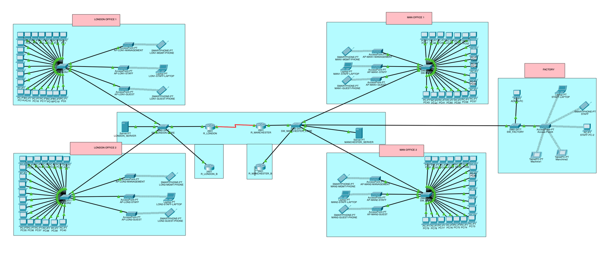

# Multi-Site Network Design (Cisco Packet Tracer)

I designed and built a network for a fictional company with around 50 staff in two cities, London and Manchester. Each city has two offices, and Manchester also has a factory. Everything was built and tested in Cisco Packet Tracer 8.2.2.

I'm working towards a SOC analyst role, and alerts only make sense when you understand the network behind them. I wanted to build something big enough that the design decisions actually mattered: how to split up the address space, how traffic gets between VLANs and between cities, and where the security controls should sit.

## What I built

- 18 VLANs, split into wired, staff Wi-Fi, guest Wi-Fi, management (VLAN 99) and servers
- An IP plan using CIDR: /26 for the office VLANs, /24 for management and servers, and /30 for the link between the two cities
- Router-on-a-stick at each site so the VLANs can talk to each other
- DHCP on both main routers, with a separate pool for each VLAN
- RIP v2 over a serial link so London and Manchester learn each other's networks
- HSRP on the management VLAN, so there is a backup gateway if the main router goes down

## Security

- SSH v2 only on the main routers, with a local admin account
- Enable secret and hashed passwords (most of each hash is covered in red in the screenshots and configs)
- Only devices on the management VLAN can SSH into the routers
- Guest Wi-Fi is blocked from the management and server networks
- Unused switch ports are shut down

More detail:

- [IP addressing plan](docs/addressing-plan.md)
- [Security setup](docs/security.md)
- [Tests](docs/testing.md)
- [Running configs for every router and switch](configs/)

## Why I built it this way

**Router-on-a-stick instead of a Layer 3 switch.** For around 50 users it's cheap and keeps routing and DHCP in one place per site. The trade-off is that every packet going between VLANs crosses the router's single G0/0 link twice (up to the router and back down again), so that link is both a bottleneck and a single point of failure. At a bigger site I'd move inter-VLAN routing onto a Layer 3 core switch.

**RIP v2 instead of OSPF.** With two routers and one WAN link, RIP does the job and is easy to check. It wouldn't scale, though. It has a 15-hop limit, it converges slowly, and it picks routes by hop count, so it can't tell a slow link from a fast one. With more sites I'd move to OSPF.

**/26 for the office VLANs.** That gives 62 usable addresses, which covers 20 desks plus wireless devices with room to grow, without giving every VLAN a full /24.

**HSRP on the management VLAN first.** When a router fails, the management network is how you get in to fix everything else, so that's where I wanted redundancy first.

## Tests

| Test | Result |
|---|---|
| Devices can ping their VLAN gateway | Pass |
| DHCP gives out the right IP, gateway and DNS | Pass |
| London PC can reach a Manchester factory device | Pass |
| Guest devices can't reach management or servers | Pass |
| Staff PC can open the intranet website | Pass |
| HSRP backup gateway works at both sites | Pass |

## Problems I found when I went back over it

When I reviewed my running configs after finishing, I found some mistakes and some things I would do differently. I'm fixing them one at a time and ticking them off here.

- [ ] **London Office 2 guest Wi-Fi doesn't work.** VLAN 55 isn't allowed on the London core switch trunks, so guest devices in Office 2 never get an IP address (they end up with a 169.254 address).
- [ ] **Two devices share the same IP.** Both core switches use the same management IP as their main router (10.10.99.2 and 10.20.99.2).
- [ ] **Guests can still reach staff PCs.** The guest ACL only blocks management and servers, then allows everything else.
- [ ] **The backup routers and the switches have no passwords.** I only locked down the two main routers.
- [ ] **The native VLAN is still VLAN 1 on every trunk**, which leaves a VLAN hopping risk.
- [ ] **RIP updates go out on every user VLAN.** I set passive-interface on G0/0 but not on the subinterfaces. The WAN interface is also labelled "unused port shutdown" by mistake, and the console still uses a type 7 password with a 1000-minute timeout.

Some other things I'd change in a real network: port security and DHCP snooping on the access switches, and a second WAN link or a VPN between the sites. Guests are also given the internal DNS server by DHCP, but the guest ACL blocks the server VLAN, so in practice they can't resolve names. On a real guest network I'd hand them a public DNS server instead.

## What I learned

**Getting the two sites talking took the longest.** What worked was going from the bottom up. First, is Serial0/0/0 up/up on both routers? (The London end is the DCE side, so it's the one that needs `clock rate`.) Then, can each router ping the other end of the /30? Only after that is it worth looking for R routes in `show ip route`. Working in that order stops you changing RIP settings when the real problem is lower down.

**The RIP `network` command is classful.** `network 10.0.0.0` turned RIP on for every interface in 10.x.x.x, including all the user and guest subinterfaces. That's why updates were being sent into VLANs with no other routers in them. It's also why `no auto-summary` doesn't change anything in this design yet. Auto-summary only happens at a classful boundary, and every subnet here, the WAN link included, sits inside 10.0.0.0/8. I turned it off anyway. If the WAN link was ever moved to a different range, both routers would start advertising a single 10.0.0.0/8 summary to each other and cross-site routing would break.

**An allowed VLAN list fails silently.** If a VLAN is missing from one trunk anywhere on the path, its frames are just dropped. Nothing logs an error. The device never gets a DHCP reply and gives itself a 169.254 address. That's exactly what happened with VLAN 55 in London. It only shows up when you compare the allowed VLANs in `show interfaces trunk` against the VLANs you've actually created. With router-on-a-stick, the number that matters is the one in `encapsulation dot1Q`, not the subinterface number. I matched them (G0/0.10 carries VLAN 10) just to keep the config readable.

**I didn't need `ip helper-address`.** Each router has a subinterface in every VLAN, so it hears the DHCP broadcasts directly. If the DHCP server lived on the server VLAN instead, every user subinterface would need a helper address to forward the broadcasts to it.

**SSH, the ACLs and HSRP were fiddly in different ways.**

- SSH won't start until the router has a hostname, a domain name and an RSA key, and version 2 needs a key of at least 768 bits.
- I had to get clear on `access-class` versus `access-group`. `access-class` on the VTY lines controls who can log in to the router itself. `access-group` on an interface filters traffic passing through it.
- I put the extended guest ACL inbound on the guest subinterfaces, so traffic gets dropped as close to its source as possible.
- The `deny any` at the end of MGMT_SSH_ONLY does the same job as the implicit deny, but writing it out gives `show access-lists` a hit counter, so blocked login attempts actually show up.

**Adding HSRP meant moving addresses.** The main routers originally used .1 on VLAN 99. I moved them to .2 and gave the backup routers .3, so .1 could become the virtual IP and nothing on the management devices had to change. `preempt` mattered more than I expected. Without it, if R_LONDON reboots, the backup router stays active even after the main one comes back. The group number also shows up in the virtual MAC (0000.0C07.AC63, because 63 is 99 in hex), which helps when you're reading ARP tables. Changing one address means checking everything else in that subnet, and I missed one: the core switches were also on .2.

**My tests only covered what I expected to work.** When I went back through my own configs I found problems my tests never caught. Next time I'd write the test plan from the requirements first, including the cases that should fail, and test every VLAN rather than one or two per site.

## Files

- `packet-tracer/`: the .pkt file (opens in Cisco Packet Tracer 8.2.2 or newer)
- `configs/`: running configs from every router and switch
- `docs/`: IP plan, security setup and tests
- `images/`: screenshots
