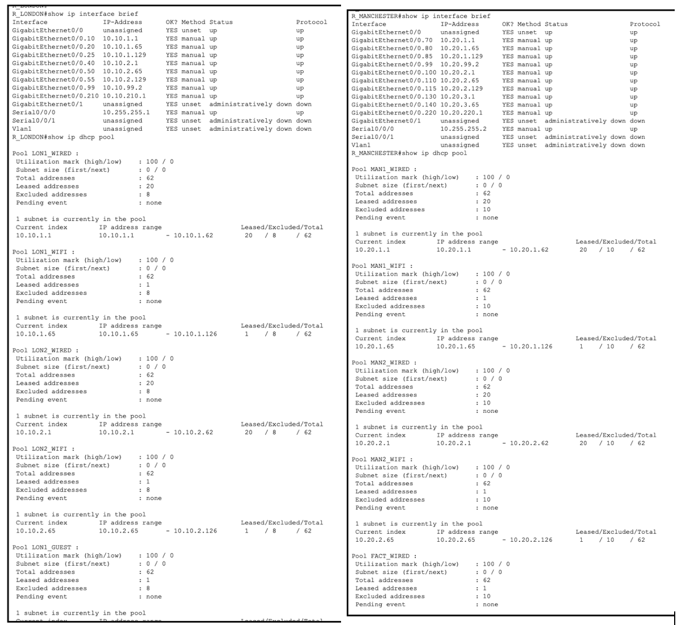
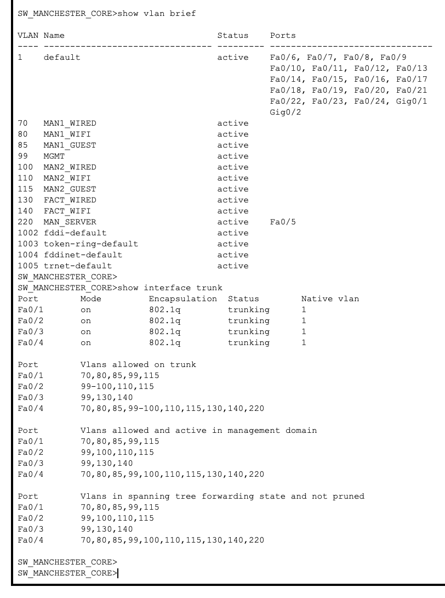
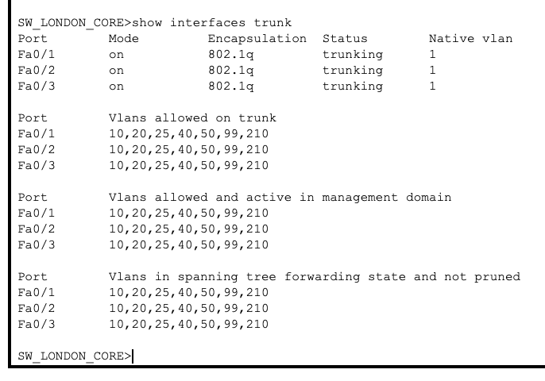
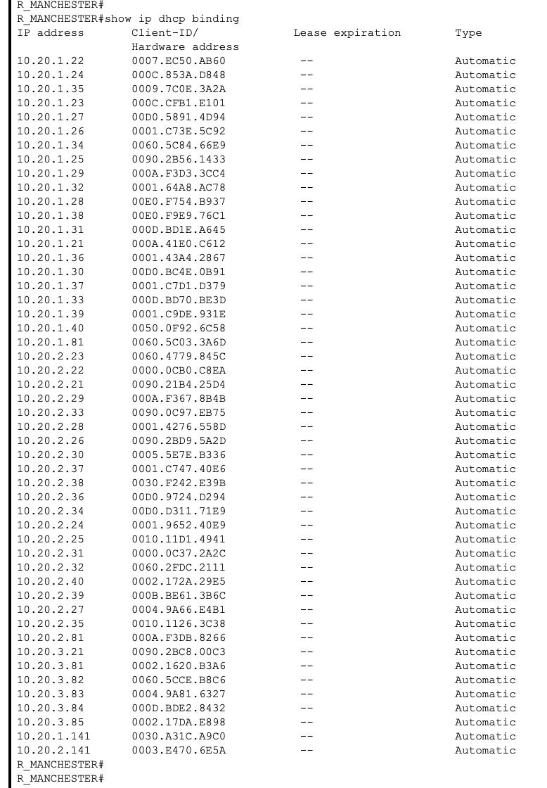
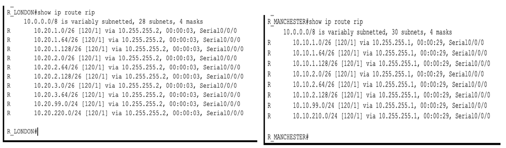
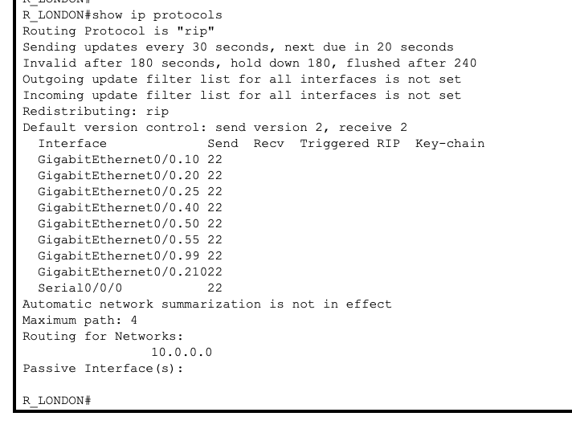

# IP Addressing Plan

London uses `10.10.x.x` and Manchester uses `10.20.x.x`, so you can tell which city an address belongs to just by looking at it. The third number works the same way: .1 is Office 1, .2 is Office 2, .3 is the factory, .99 is management (matching VLAN 99), and .210 and .220 are the server VLANs. When something shows up in a log or a ping fails, the address alone tells you roughly where to look.

I used /26 for the office VLANs. That gives 62 usable addresses, which is enough for the 20 desk PCs in each office plus wireless devices, with room to grow. Management and servers got a /24 because they're easier to manage and will probably grow. The link between the two routers is a /30 because it only needs two addresses.

The gateway is always the first usable address in each subnet.

## London (R_LONDON)

| VLAN | What it's for | Network | Gateway |
|---|---|---|---|
| 10 | Office 1 wired | 10.10.1.0/26 | 10.10.1.1 |
| 20 | Office 1 staff Wi-Fi | 10.10.1.64/26 | 10.10.1.65 |
| 25 | Office 1 guest Wi-Fi | 10.10.1.128/26 | 10.10.1.129 |
| 40 | Office 2 wired | 10.10.2.0/26 | 10.10.2.1 |
| 50 | Office 2 staff Wi-Fi | 10.10.2.64/26 | 10.10.2.65 |
| 55 | Office 2 guest Wi-Fi | 10.10.2.128/26 | 10.10.2.129 |
| 99 | Management | 10.10.99.0/24 | 10.10.99.1 (HSRP) |
| 210 | Servers | 10.10.210.0/24 | 10.10.210.1 |

## Manchester (R_MANCHESTER)

| VLAN | What it's for | Network | Gateway |
|---|---|---|---|
| 70 | Office 1 wired | 10.20.1.0/26 | 10.20.1.1 |
| 80 | Office 1 staff Wi-Fi | 10.20.1.64/26 | 10.20.1.65 |
| 85 | Office 1 guest Wi-Fi | 10.20.1.128/26 | 10.20.1.129 |
| 100 | Office 2 wired | 10.20.2.0/26 | 10.20.2.1 |
| 110 | Office 2 staff Wi-Fi | 10.20.2.64/26 | 10.20.2.65 |
| 115 | Office 2 guest Wi-Fi | 10.20.2.128/26 | 10.20.2.129 |
| 130 | Factory wired | 10.20.3.0/26 | 10.20.3.1 |
| 140 | Factory Wi-Fi | 10.20.3.64/26 | 10.20.3.65 |
| 99 | Management | 10.20.99.0/24 | 10.20.99.1 (HSRP) |
| 220 | Servers | 10.20.220.0/24 | 10.20.220.1 |

VLAN 99 is used in both cities, but they're separate networks with different subnets.

## WAN link and HSRP

| What | Device | Address |
|---|---|---|
| WAN link (10.255.255.0/30) | R_LONDON Serial0/0/0 | 10.255.255.1 |
| | R_MANCHESTER Serial0/0/0 | 10.255.255.2 |
| London management gateway | HSRP virtual IP | 10.10.99.1 |
| | R_LONDON (active, priority 110) | 10.10.99.2 |
| | R_LONDON_B (standby, priority 90) | 10.10.99.3 |
| Manchester management gateway | HSRP virtual IP | 10.20.99.1 |
| | R_MANCHESTER (active, priority 110) | 10.20.99.2 |
| | R_MANCHESTER_B (standby, priority 90) | 10.20.99.3 |

## Servers

- London web server (`intranet.citynet.local`): 10.10.210.10
- London DNS server, given out to London clients by DHCP: 10.10.210.10
- Manchester DNS server, given out to Manchester clients by DHCP: 10.20.220.10

## DHCP

Each main router runs DHCP for its own city, with one pool per wired, staff Wi-Fi and guest VLAN (6 pools in London, 8 in Manchester). Management devices and servers use static addresses, so they don't have pools.

- The start of every subnet is excluded so it stays free for the gateway, access points and anything static: .1 to .20 on the wired, management and server subnets, .65 to .80 on the staff Wi-Fi subnets, and .129 to .140 on the guest subnets.
- That's why the first wired lease is .21 (you can see this in the DHCP bindings screenshot below) and the first guest lease is .141.
- Every pool hands out the city's DNS server and the domain `citynet.local`.

The router has a subinterface in every VLAN, so it hears DHCP broadcasts directly and no `ip helper-address` is needed. If DHCP moved to a server on the server VLAN, each user subinterface would need a helper address to forward the broadcasts to it.

## Screenshots

Router subinterfaces and DHCP pools:

Manchester core switch VLANs and trunks:

London core switch trunks:

DHCP leases on the Manchester router:

RIP v2 routes each router learned from the other city:

RIP status on R_LONDON. Every subinterface is sending RIP updates, which is one of the things I'm fixing (see the README):

