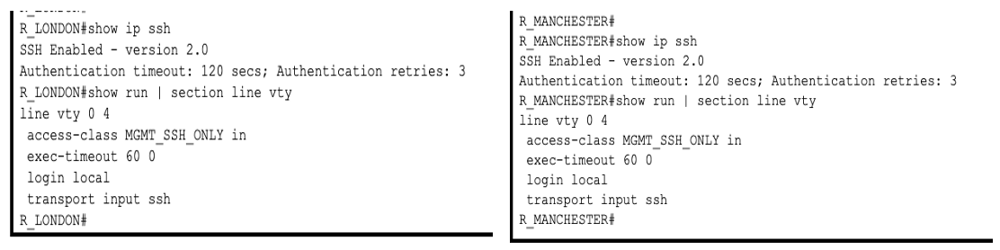
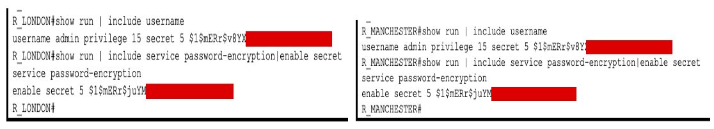
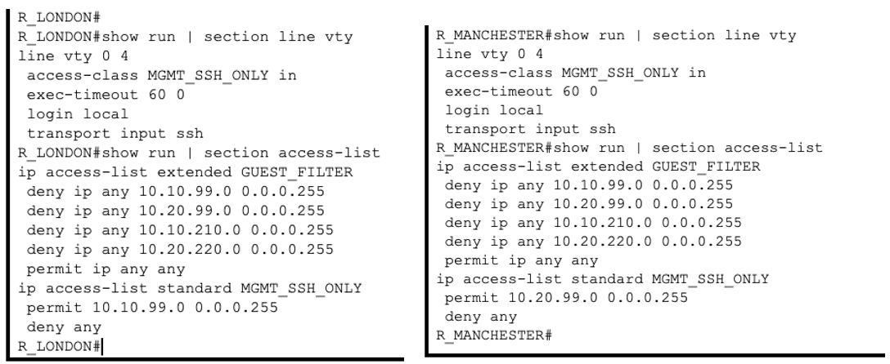
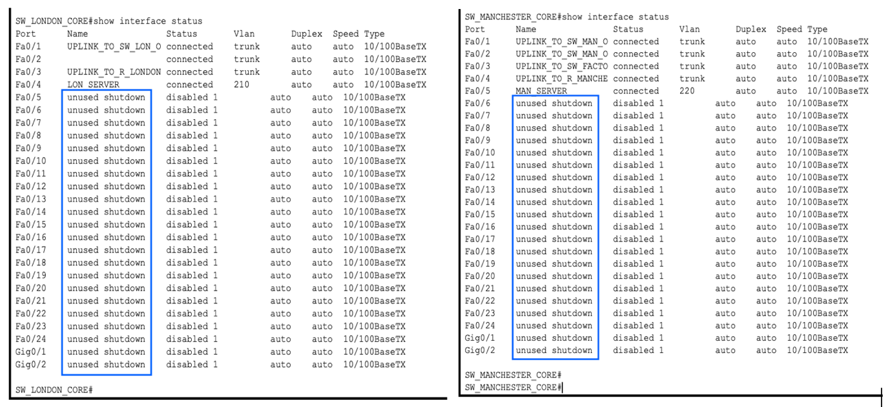

# Security Setup

## SSH instead of Telnet

Telnet sends everything in plain text, passwords included, so the main routers only accept SSH version 2. Logins use a local admin account (`login local`) rather than a shared line password, so every session is tied to a username.

For SSH to work at all, the router needs a hostname, a domain name (`ip domain-name citynet.local`) and an RSA key pair. Version 2 needs a key of at least 768 bits.



## Hashed passwords

- `enable secret` stores the enable password as a hash, not plain text
- The admin account uses `secret` rather than `password`, so it's hashed too
- `service password-encryption` hides any other passwords in the config

In the screenshot and the configs I've left the start of each hash visible and covered the rest. `$1$` means it's an MD5-based hash (Cisco type 5), and `mERr` is the salt. The passwords in this lab aren't used anywhere else, and the .pkt file has the full config anyway, but I don't like publishing hashes. Weak passwords can be cracked from them offline, so I've kept to the habit here.



The console password is still type 7. Type 7 isn't really encryption because it can be reversed to plain text in seconds, so it only stops someone reading it over your shoulder. On the next version I'd move the console to `login local` as well.

## Only the management VLAN can log in

A standard ACL on the VTY lines means SSH is only accepted from the management subnet. Staff and guest devices can't open a login session even if they know the password. Each site's routers only accept logins from that site's own management VLAN.

```
ip access-list standard MGMT_SSH_ONLY
 permit 10.10.99.0 0.0.0.255
 deny any
!
line vty 0 4
 access-class MGMT_SSH_ONLY in
 login local
 transport input ssh
```

`access-class` is the right tool here, rather than `access-group`, because it filters who can connect to the router itself, not traffic passing through it. The `deny any` does the same as the implicit deny at the end of every ACL, but writing it out gives `show access-lists` a counter, so blocked login attempts show up.

## Guest Wi-Fi isolation

An extended ACL called `GUEST_FILTER` is applied inbound on every guest Wi-Fi subinterface. Guests still get an IP address and can connect, but they can't reach the management or server networks in either city. Applying it inbound on the guest subinterface means traffic is dropped as soon as it reaches the router, as close to the source as possible.

```
ip access-list extended GUEST_FILTER
 deny ip any 10.10.99.0 0.0.0.255
 deny ip any 10.20.99.0 0.0.0.255
 deny ip any 10.10.210.0 0.0.0.255
 deny ip any 10.20.220.0 0.0.0.255
 permit ip any any
```



ACLs are read top to bottom and stop at the first match, so the `permit ip any any` at the end lets guests reach everything I didn't deny, including staff devices. That's on my list of fixes in the README.

## Unused ports shut down

Every unused port on the core switches is shut down and labelled, so nobody can get onto the network by plugging into a spare port.



## Backup gateway (HSRP)

Each city has a second router sharing a virtual gateway address on VLAN 99. The main router has priority 110 and the backup has 90, and both have `preempt` set so the main router takes the active role back after a reboot. Management devices only ever use the virtual IP (.1), so a failover doesn't need any change on their side. See Test 6 in the [tests](testing.md).
