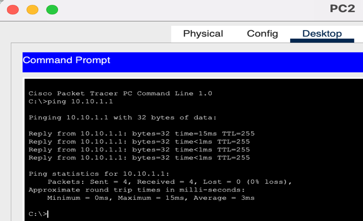
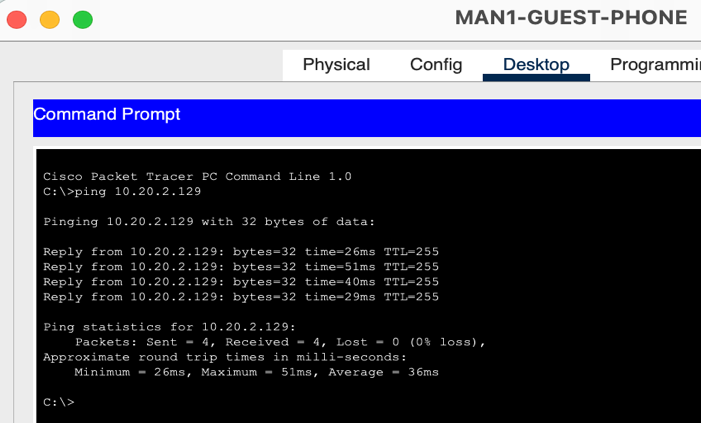
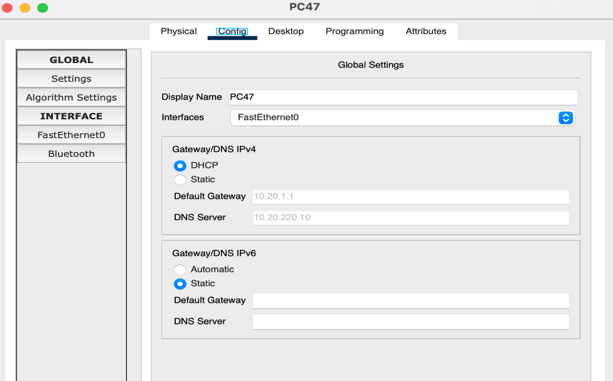
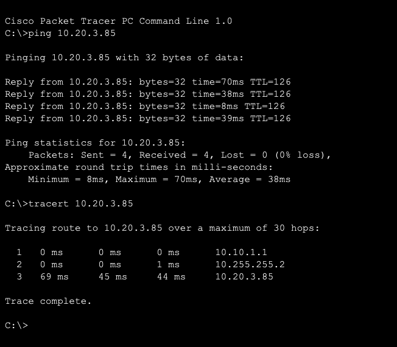
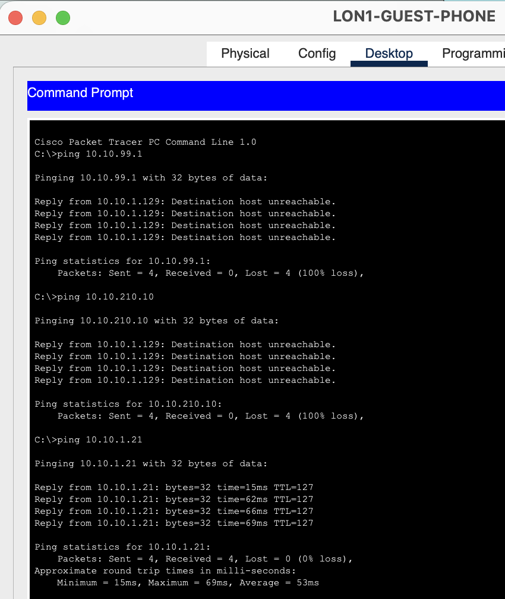
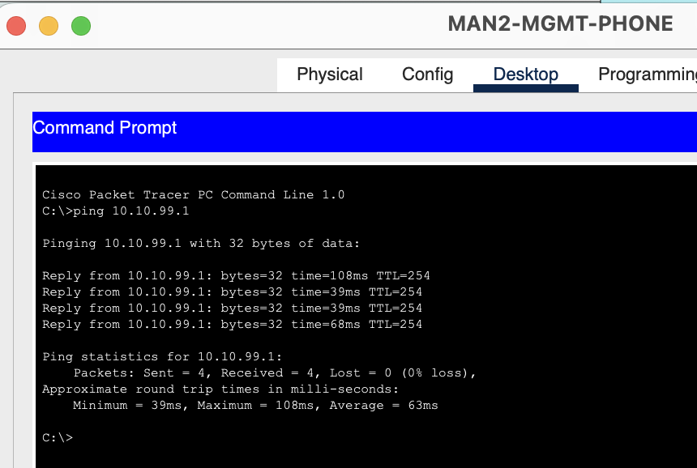
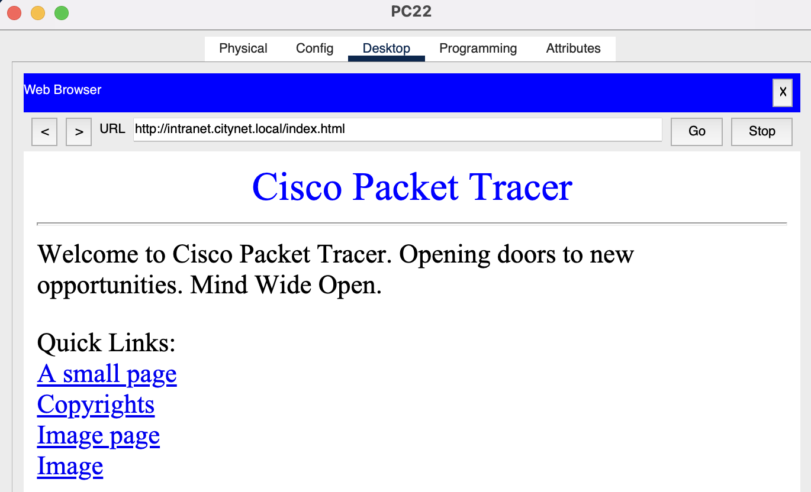
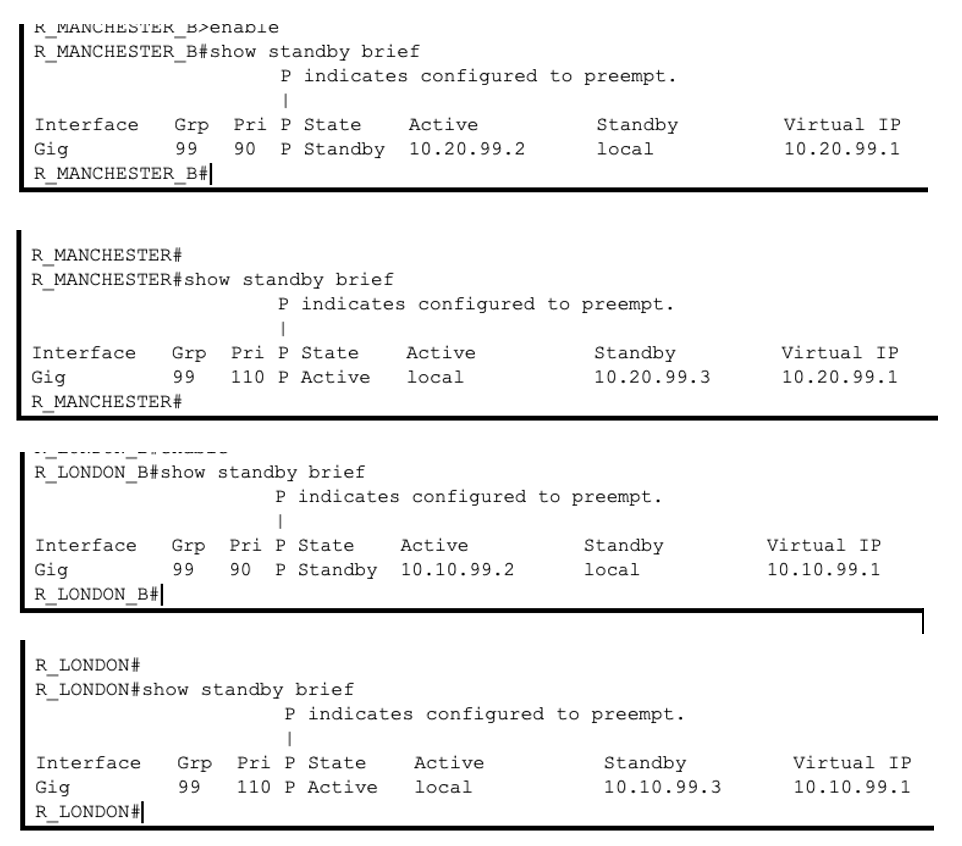

# Tests

I tested everything from the end devices and with show commands on the routers and switches.

## Test 1: Devices can ping their gateway

This checks the VLAN tagging and router-on-a-stick are working. A London wired PC pings its gateway (10.10.1.1), and a Manchester guest phone pings a Manchester guest gateway (10.20.2.129).

Both replied. **Pass**

## Test 2: DHCP gives out the right settings

I set devices to DHCP and checked they got an address in the right subnet, the right gateway and the DNS server. I also checked the leases on the router ([DHCP bindings](../images/dhcp-bindings.png)).

**Pass**

## Test 3: London to Manchester factory

From a London Office 1 PC I pinged a factory device in Manchester (10.20.3.85), then ran `tracert`. The path goes London gateway (10.10.1.1) → R_MANCHESTER's end of the WAN link (10.255.255.2) → the factory device, which shows the traffic is following the route RIP learned.

The first two hops answer in 0 to 1 ms but the last hop takes 40 to 70 ms. That isn't the WAN link. 10.20.3.85 is on the factory Wi-Fi VLAN (10.20.3.64/26), and in Packet Tracer the wireless devices were consistently slower (20 to 100 ms) than wired ones. The TTL of 126 also fits: the device started at 128 and two routers each took one off.

**Pass**

## Test 4: Guest isolation and management access

| From | To | Expected | Result |
|---|---|---|---|
| London guest phone | Management gateway 10.10.99.1 | Blocked | Blocked |
| London guest phone | Server 10.10.210.10 | Blocked | Blocked |
| London guest phone | Wired PC 10.10.1.21 | Allowed by the current ACL | Allowed |
| Manchester management phone | London management gateway 10.10.99.1 | Allowed | Allowed |

The ACL does what it's configured to do. **Pass.** The guest reaching a wired PC is a problem with my design, not a failed test, and it's on my fix list.

## Test 5: Web server

I turned on HTTP and DNS on the London server and opened `http://intranet.citynet.local` from a staff PC.

The page loaded, so DNS and routing to the server VLAN both work. **Pass**

## Test 6: HSRP backup gateway

`show standby brief` on all four routers. In each city the main router is active (priority 110) and the backup is standby (priority 90), and they share the virtual IP ending in .1. The P next to each priority means preempt is on.

**Pass**
